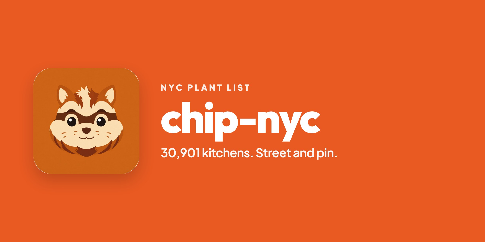

# chip-nyc

<p>
  
</p>

Plant list for [Chip](https://chip.family). Every licensed kitchen in New York City, with street and pin.

**Not a live menu.** Nothing here is Open. Owner yes Opens on chip.family. This is not DoorDash.

Source: [NYC DOHMH Restaurant Inspection Results](https://data.cityofnewyork.us/Health/DOHMH-New-York-City-Restaurant-Inspection-Results/43nn-pn8j) (`43nn-pn8j`). Unique `CAMIS`. Public.

Browse a ZIP (name + street): **[4d-studio.github.io/chip-nyc](https://4d-studio.github.io/chip-nyc/?zip=11372)**

## Call it

One cell (what Chip should fetch):

```
https://raw.githubusercontent.com/4d-Studio/chip-nyc/main/zips/11372.json
https://cdn.jsdelivr.net/gh/4d-Studio/chip-nyc@main/zips/11372.json
```

City book:

```
https://raw.githubusercontent.com/4d-Studio/chip-nyc/main/nyc.json
https://raw.githubusercontent.com/4d-Studio/chip-nyc/main/nyc.json.gz
https://raw.githubusercontent.com/4d-Studio/chip-nyc/main/index.json
```

```js
const zip = "11372";
const data = await fetch(
  `https://cdn.jsdelivr.net/gh/4d-Studio/chip-nyc@main/zips/${zip}.json`,
).then((r) => r.json());
// data.places: [{ id, name, street, zip, boro, cuisine, bag, lat, lng }]
```

`bag=yes` can plate. `maybe` is coffee / donuts / bakery. Filter in the client.

## Files

| File | |
|---|---|
| `index.json` | ZIP list + counts |
| `zips/11372.json` | One cell |
| `nyc.json` | All 30,901 |
| `nyc.json.gz` | Same, gzipped |

Each kitchen: `id`, `name`, `street`, `zip`, `boro`, `cuisine`, `bag`, `lat`, `lng`.

No phone. No website. No menu. No Open flag. No walk-in code.

## Refresh

On the Chip `cli` branch:

```
chip census --nyc
python3 scripts/build.py
```

`scripts/build.py` reads `~/.chip/nyc-census.json` and rewrites this repo. Do not scrape DoorDash, Uber, Grubhub, or Yelp.

## License

Code in this repo is MIT. The restaurant rows are NYC Open Data. Attribute DOHMH. Chip does not claim the names.
